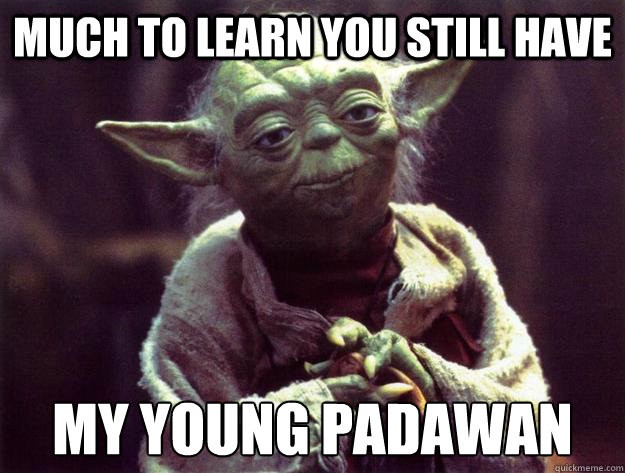
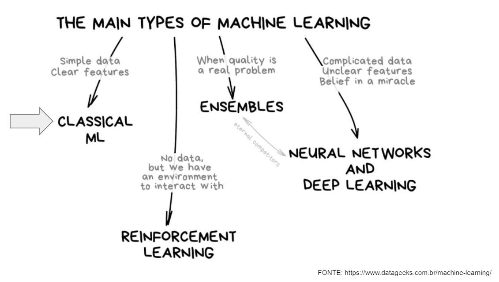
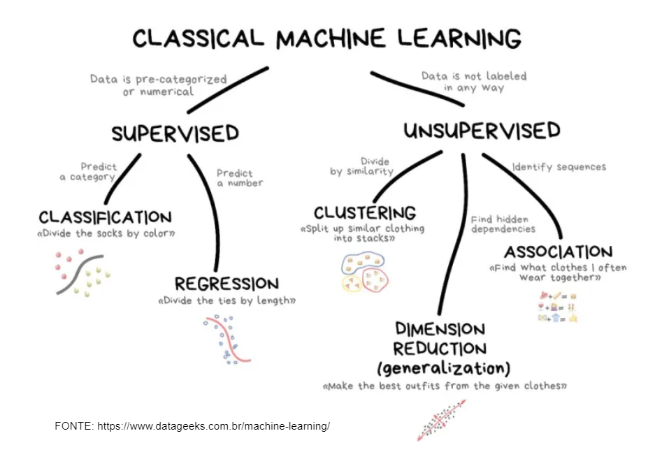

# Tópicos de Machine Learning
-----------------------------

#### Quero começar um projeto de Machine Learning, mas eu não sei nada sobre. E agora?

 

 
E sobre o que este repositório se trata?

Aqui você vai encontrar alguns exemplos, em notebooks, de como manipular análises e modelos de Machine Learning clássicos em python para dar um start na sua jornada. Sendo assim, os notebooks cobrem os seguintes conteúdos:

 

  <b>Que a força esteja com você !!!</b>

